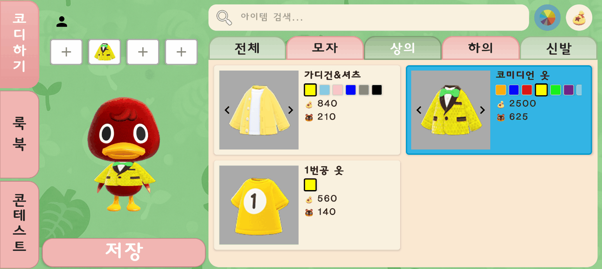
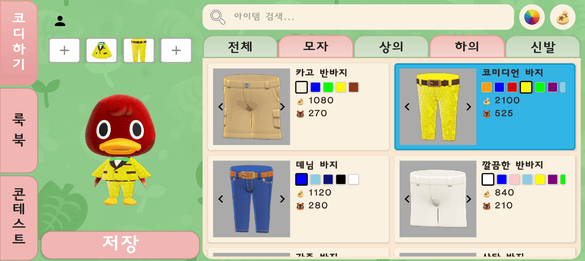

# NookStyle

**슬로건**: _"리처드"_

---

## 📱 프로젝트 소개

**NookStyle**은 _모여봐요 동물의 숲_ 시리즈 유저들을 위한 코디네이션 앱입니다.  
쉽고 빠르게 의상과 소품을 조합하고, 저장하고, 공유할 수 있도록 돕습니다.

---

## 🌟 주요 기능

- **코디하기**: 좋아하는 동물의 숲 캐릭터를 선택하고, 잘 어울릴 것 같은 의상을 선택해 꾸며보세요.
- **룩북**: 완성된 코디를 앱에 저장하고, 언제든지 코디를 확인하세요.
- **콘테스트**: 나만의 코디를 출품해 공유하고, 다른 유저들의 코디를 확인해보세요.

> 📌 사용 기술: `Android Studio & Kotlin` (클라이언트), `Figma` (UI 디자인) `Aseprite`(이미지 프로세스)

---

## 👨‍👩‍👧‍👦 팀원

| 이름 | 학교 | Github ID | 
|------|------|:------:|
| 박지헌 | KAIST 19 | [happyfacehappyface](https://github.com/happyfacehappyface) |
| 윤신이 | DGIST 22 | [sini](https://github.com/tlsdl6942) |

---

## 📸 시연 영상

| 시연 영상 | 기능 |
|-------------|------|
|  | 캐릭터 및 의상 선택, 의상 필터링 기능 |
|  | 의상 선택 해제, 이미지 저장 |
|  | 저장된 룩북 확인, 콘테스트 출품 |
|  | 콘테스트에 출품된 룩북 확인, 좋아요 및 신고 기능 |

---

## 📦 APK 파일

> 최신 버전 다운로드:

---

## 📌 기타

- 본 앱은 Nintendo 및 Animal Crossing 공식 콘텐츠와는 무관한 팬 제작 앱입니다.
- 모든 이미지는 사용자로부터 직접 촬영/편집되었으며 상업적 용도가 아닙니다.
